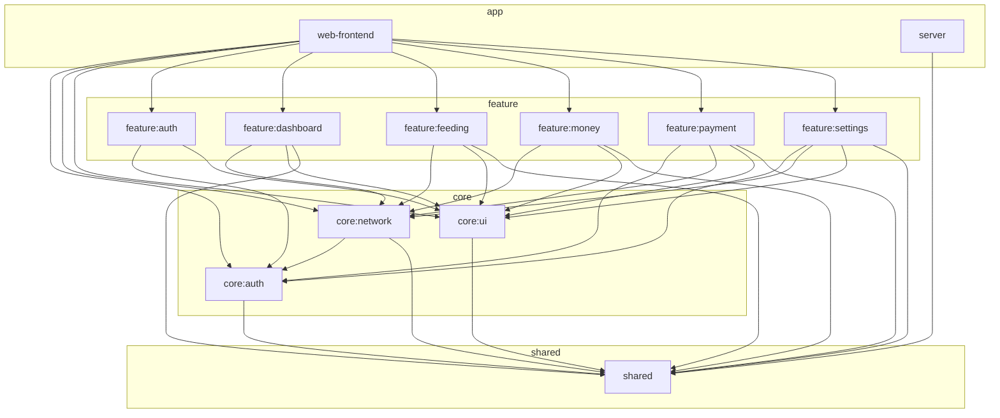

# CrabShell

Kotlin Multiplatform のダッシュボードアプリケーション。Ktor サーバー + Compose for Web (WASM) フロントエンド。

## 技術スタック

| カテゴリ | 技術 | バージョン |
|---|---|---|
| 言語 | Kotlin | 2.3.0 |
| UI | Compose Multiplatform | 1.10.0 |
| サーバー | Ktor (Netty) | 3.4.0 |
| DI | Koin | 4.2.0-RC1 |
| 認証 | Firebase Admin / Firebase JS SDK | 9.4.3 |
| ViewModel | Lifecycle ViewModel Compose | 2.9.6 |
| シリアライゼーション | kotlinx-serialization-json | 1.8.1 |
| JDK | Eclipse Temurin | 21 |

## アーキテクチャ

MVVM パターンで関心事を分離。ViewModel がビジネスロジック・状態管理を担当し、Screen (Composable) は UI 描画のみ。

モジュールは4層に分かれる:

| 層 | モジュール | 説明 |
|---|---|---|
| **shared** | `shared` | 共有データモデル（JVM + wasmJs） |
| **core** | `core:auth`, `core:network`, `core:ui` | 認証・通信・UI 基盤 |
| **feature** | `feature:auth`, `feature:dashboard`, `feature:feeding`, `feature:money`, `feature:payment`, `feature:settings` | 各画面の ViewModel + Screen |
| **app** | `web-frontend`, `server` | アプリシェル / API サーバー |

### 依存関係図



## 構成

```
shared/              → 共有データモデル（JVM + wasmJs）
server/              → Ktor サーバー（API + 静的ファイル配信）
core/auth/           → Firebase 認証・AuthState 管理
core/network/        → 認証付き HTTP クライアント + Repository
core/ui/             → テーマ・共通 UI コンポーネント
feature/auth/        → ログイン画面
feature/dashboard/   → ダッシュボード画面
feature/feeding/     → ごはん記録画面
feature/money/       → 支出管理画面（管理者向け）
feature/payment/     → 支払い画面（ユーザー向け）
feature/settings/    → 設定画面
web-frontend/        → アプリシェル（ルーティング・レイアウト）
```

## セットアップ

```bash
# サーバー起動（フロントエンドも自動ビルド）
./gradlew :server:run

# フロントエンドのみビルド
./gradlew :web-frontend:wasmJsBrowserDistribution
```

サーバーは `http://localhost:8080` で起動。

### 開発モード（Split Mode）

フロントエンドとサーバーを分離起動し、UI 変更の反映を高速化する。フルビルド（約5分）→ インクリメンタルビルド（数十秒）。

```bash
# Terminal 1: API サーバー（fat JAR をビルドして直接起動）
./gradlew :server:buildFatJar -PskipFrontend && java -jar server/build/libs/server-all.jar

# Terminal 2: webpack dev server（フロントエンド開発用）
./gradlew :web-frontend:wasmJsBrowserDevelopmentRun

# ブラウザ: http://localhost:3000
```

- webpack dev server (port 3000) が `/api/*` を Ktor サーバー (port 8080) にプロキシ
- `-PskipFrontend` でサーバービルド時に WASM フロントエンドのビルドをスキップ

| 変更箇所 | 操作 |
|----------|------|
| feature/ や core/ の Kotlin (UI) | Terminal 2 を **Ctrl+D → 再実行** |
| server/ の Kotlin (API) | Terminal 1 を再ビルド＆再起動 |
| shared/ のモデル変更 | 両方再起動 |

## Docker

```bash
docker compose up -d --build    # ビルド＆バックグラウンド起動
docker compose down              # 停止
docker compose logs -f           # ログ確認
```

Dockerfile はマルチステージビルド（Gradle でビルド → JRE で実行）。ビルドステージで WASM フロントエンド + fat JAR を生成し、実行ステージは `eclipse-temurin:21-jre` 上で起動する。

## Lint

ktlint を全サブプロジェクトに適用済み。

```bash
# 自動フォーマット
./gradlew ktlintFormat

# チェックのみ
./gradlew ktlintCheck
```

## ブランチ戦略（GitHub Flow）

`main` ブランチを常にデプロイ可能な状態に保つシンプルなフローを採用。

1. `main` から機能ブランチを作成
2. ブランチ上でコミットを重ねる
3. Pull Request を作成してレビューを依頼
4. レビュー承認後、`main` にマージ
5. マージ後にブランチを削除

### ブランチ命名規則

`feat/`, `fix/`, `chore/`, `refactor/` + 簡潔な説明（例: `feat/websocket-realtime`）

### ルール

- `main` に直接 push しない — 常に PR 経由
- PR はマージ前にレビューを受ける
- マージ後にブランチを削除して整理する
