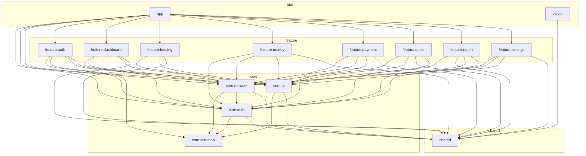

# CrabShell

Kotlin Multiplatform のダッシュボードアプリケーション。Ktor サーバー + Compose for Web (WASM) フロントエンド。

## 技術スタック

| カテゴリ | 技術 | バージョン |
|---|---|---|
| 言語 | Kotlin | 2.3.10 |
| UI | Compose Multiplatform | 1.10.2 |
| サーバー | Ktor (Netty) | 3.4.1 |
| DI | Koin | 4.2.0 |
| 認証 | Firebase Admin / Firebase JS SDK + WebAuthn (Passkey) | 9.8.0 |
| WebAuthn | webauthn4j | 0.31.1.RELEASE |
| DB (Passkey) | Exposed + SQLite | 1.1.1 / 3.51.3.0 |
| ViewModel | Lifecycle ViewModel Compose | 2.9.6 |
| シリアライゼーション | kotlinx-serialization-json | 1.10.0 |
| JDK | Eclipse Temurin | 21 |

## アーキテクチャ

MVVM パターンで関心事を分離。ViewModel がビジネスロジック・状態管理を担当し、Screen (Composable) は UI 描画のみ。

モジュールは4層に分かれる:

| 層 | モジュール | 説明 |
|---|---|---|
| **shared** | `shared` | 共有データモデル（全モジュール共通） |
| **core** | `core:common`, `core:auth`, `core:network`, `core:ui` | 横断ユーティリティ・認証・通信・UI 基盤 |
| **feature** | `feature:auth`, `feature:dashboard`, `feature:feeding`, `feature:money`, `feature:payment`, `feature:quest`, `feature:report`, `feature:settings` | 各画面の ViewModel + Screen |
| **app** | `app`, `server` | アプリシェル / API サーバー |

### 依存関係図



## 構成

```
build-logic/         → Convention Plugin（KMP + Compose + wasmJs 共通設定）
shared/              → 共有データモデル（全モジュール共通）
server/              → Ktor サーバー（API + 静的ファイル配信）
core/common/         → 環境判定・AppLogger・横断的ユーティリティ
core/auth/           → Firebase 認証・AuthState 管理・WebAuthn JS interop
core/network/        → 認証付き HTTP クライアント + Repository（Passkey 含む）
core/ui/             → テーマ・共通 UI コンポーネント
feature/auth/        → ログイン画面（パスキー / メール・パスワード）+ パスキー登録
feature/dashboard/   → ダッシュボード画面
feature/feeding/     → ごはん記録画面
feature/money/       → 支出管理画面（管理者向け）
feature/payment/     → 支払い画面（ユーザー向け）
feature/quest/       → クエスト画面
feature/report/      → 家計レポート画面（月別支出グラフ・内訳）
feature/settings/    → 設定画面（パスワード変更・パスキー管理・ログイン履歴・ペット設定）
app/                 → アプリシェル（ルーティング・レイアウト）
```

## セットアップ

### 開発

フロントエンドとサーバーを分離起動し、UI 変更の反映を高速化する。フルビルド（約5分）→ インクリメンタルビルド（数十秒）。

```bash
# 1. 環境変数を設定（初回のみ）
cp .env.example .env
# .env を編集して GEMINI_API_KEY 等を設定
```

#### dev.sh（推奨）

`dev.sh` でサーバー・フロントエンドをバックグラウンド管理できる。PID ファイル（`.dev/`）で状態を追跡する。ブラウザの自動起動は抑制される。

```bash
./dev.sh start              # サーバー + フロントエンド両方起動
./dev.sh stop               # 両方停止
./dev.sh server restart     # サーバーのみ再起動
./dev.sh frontend restart   # フロントエンドのみ再起動
./dev.sh status             # 両方の状態を表示
./dev.sh server log         # サーバーログを tail -f
```

Tab 補完を有効化するには `.zshrc` に以下を追加:

```bash
eval "$(./dev.sh --completions)"
```

#### 手動起動

```bash
# Terminal 1: API サーバー（fat JAR をビルドして直接起動）
./gradlew :server:buildFatJar -PskipFrontend && java -jar server/build/libs/server-all.jar

# Terminal 2: webpack dev server（フロントエンド開発用）
./gradlew :app:wasmJsBrowserDevelopmentRun

# ブラウザ: http://localhost:3000
# Swagger UI: http://localhost:3000/swagger（SWAGGER_ENABLED=true 時のみ）
```

サーバーはプロジェクトルートの `.env` ファイルから環境変数を自動読み込みする（[dotenv-java](https://github.com/cdimascio/dotenv-java) 使用）。`.env` が存在しない場合は無視される。OS の環境変数が `.env` より優先される。

- webpack dev server (port 3000) が `/api/*` を Ktor サーバー (port 8080) にプロキシ
- `-PskipFrontend` でサーバービルド時に WASM フロントエンドのビルドをスキップ
- `BROWSER_OPEN=false` を設定するとブラウザ自動起動を抑制（dev.sh は自動で設定）

| 変更箇所 | dev.sh | 手動 |
|----------|--------|------|
| feature/ や core/ の Kotlin (UI) | `./dev.sh frontend restart` | Terminal 2 を **Ctrl+D → 再実行** |
| server/ の Kotlin (API) | `./dev.sh server restart` | Terminal 1 を再ビルド＆再起動 |
| shared/ のモデル変更 | `./dev.sh restart` | 両方再起動 |

### 本番（GHCR デプロイ）

Dockerfile はマルチステージビルド（Gradle でビルド → JRE Alpine で実行）。ビルド済みイメージを GHCR から pull して実行する。リバースプロキシ（Traefik 等）が外部ネットワーク上で TLS 終端・ポート公開を担当する前提。HEALTHCHECK 付き。

#### デプロイ方法

`v*` タグを push すると CD ワークフローが Docker イメージをビルドし GHCR に push する。本番サーバーが定期的にイメージを pull して自動反映。

```bash
# main にマージ済みの状態でタグを打つ
git checkout main && git pull
git tag v1.0.0
git push origin v1.0.0
# → CD が ghcr.io/ptknktq/crabshell:latest と :v1.0.0 を push
```

#### 手動ビルド & push（CD を使わない場合）

```bash
# GHCR にログイン（Personal Access Token に write:packages 権限が必要）
echo $GITHUB_TOKEN | docker login ghcr.io -u <GitHubユーザー名> --password-stdin

# ビルド & push（COMMIT_HASH を渡すとサイドバーにコミットハッシュが表示される）
docker build --build-arg COMMIT_HASH=$(git rev-parse --short HEAD) \
  -t ghcr.io/ptknktq/crabshell:latest .
docker push ghcr.io/ptknktq/crabshell:latest
```

#### 本番サーバーでの起動

以下のファイルを同じディレクトリに配置する。

`.env`:

```
WEBAUTHN_RP_ID=example.com
WEBAUTHN_ORIGIN=https://example.com
```

サブドメインの場合、`WEBAUTHN_RP_ID` には親ドメインを指定する:

```
WEBAUTHN_RP_ID=example.com
WEBAUTHN_ORIGIN=https://app.example.com
```

`docker-compose.yml`:

```yaml
services:
  crabshell:
    image: ghcr.io/ptknktq/crabshell:latest
    container_name: crabshell
    env_file: .env
    volumes:
      - ./firebase-service-account.json:/app/firebase-service-account.json:ro
      - app-data:/app/data
      # 任意: IP ジオロケーション用 GeoLite2 DB（後述）
      - ./GeoLite2-City.mmdb:/app/data/GeoLite2-City.mmdb:ro
    restart: unless-stopped
    networks:
      - web

volumes:
  app-data:

networks:
  web:
    external: true
```

リバースプロキシと共有する外部ネットワークを事前に作成しておく:

```bash
docker network create web
```

```bash
# GHCR にログイン
echo $GITHUB_TOKEN | docker login ghcr.io -u <GitHubユーザー名> --password-stdin

# 起動
docker compose up -d

# 更新
docker compose pull && docker compose up -d
```

## API 設計

### リクエスト body の DTO ラップ

リクエスト body は 1 フィールドでも必ず DTO でラップする。`setBody(status)` のように enum / プリミティブを直接渡すと、JSON ルートが裸の文字列（`"FROZEN"` など）やリテラルになり、クライアント実装者にとって直感に反する。また将来フィールドを追加する場合に互換性が壊れる。

`MonthlyMoneyStatusUpdate(status)` のような単一フィールド DTO を `shared/` に定義して `{ "status": "..." }` 形式で送受信する。Swagger UI の body 表示も自然になる。

## セキュリティ

### CORS

サーバーはフロントエンド（WASM）を同一オリジンで配信する構成のため、CORS プラグインは不要であり、意図的に設定していない。開発時も webpack dev server がプロキシするため、フロントエンドから見れば同一オリジンとなる。

> **Note:** 過去に CORS プラグインを導入→削除した経緯がある（PR #48）。同一オリジン配信である限り、再導入は不要。

### セキュリティヘッダ

以下のヘッダは本番環境のリバースプロキシ側で設定する。アプリケーション側では設定しない（重複するとヘッダ値が矛盾し、挙動が不定になるため）。

| ヘッダ | 推奨値 |
|--------|--------|
| `Strict-Transport-Security` | `max-age=31536000; includeSubDomains` |
| `X-Frame-Options` | `SAMEORIGIN` |
| `X-Content-Type-Options` | `nosniff` |
| `Referrer-Policy` | `strict-origin-when-cross-origin` |
| `Permissions-Policy` | `geolocation=(), camera=(), microphone=()` |

## 認証

Firebase Auth + Passkey (WebAuthn) のハイブリッド認証。

### ユーザー登録

Firebase Authentication でユーザーを管理する。アプリ内にユーザー登録画面はないため、Firebase コンソールで直接作成する。

1. [Firebase コンソール](https://console.firebase.google.com/) → Authentication → Users
2. 「ユーザーを追加」でメールアドレスとパスワードを設定

### admin 権限の付与

一部の機能（支出管理、レポート閲覧等）は admin カスタムクレームを持つユーザーのみアクセスできる。Firebase コンソールの GUI ではカスタムクレームを設定できないため、Node.js スクリプトで付与する。

```bash
# プロジェクトルートで実行

# 初回のみ: firebase-admin をインストール
npm init -y && npm install firebase-admin

# admin クレームを付与（メールアドレスを書き換えて実行）
GOOGLE_APPLICATION_CREDENTIALS=firebase-service-account.json \
node -e "
  const { initializeApp, applicationDefault } = require('firebase-admin/app');
  const { getAuth } = require('firebase-admin/auth');
  initializeApp({ credential: applicationDefault() });
  getAuth().getUserByEmail('user@example.com')
    .then(u => getAuth().setCustomUserClaims(u.uid, { admin: true }))
    .then(() => { console.log('Done'); process.exit(); })
    .catch(console.error);
"
```

権限を解除する場合は `{ admin: true }` を `{}` に変更する。

```bash
GOOGLE_APPLICATION_CREDENTIALS=firebase-service-account.json \
node -e "
  const { initializeApp, applicationDefault } = require('firebase-admin/app');
  const { getAuth } = require('firebase-admin/auth');
  initializeApp({ credential: applicationDefault() });
  getAuth().getUserByEmail('user@example.com')
    .then(u => getAuth().setCustomUserClaims(u.uid, {}))
    .then(() => { console.log('Done'); process.exit(); })
    .catch(console.error);
"
```

変更後、ユーザーが一度ログアウト→再ログインするとクレームが反映される。

### ログインフロー

1. **初回**: メール/パスワードでログイン → パスキー登録を案内
2. **以降**: メールアドレス入力 → パスキーでログイン（パスワード不要）

ログイン成功時にサーバーへログイン履歴を記録する（IP アドレス・UserAgent・ログイン方法・IP から解決した大まかな国/地域/都市）。設定画面のアカウントカテゴリから直近の履歴を確認できる。履歴は Firestore の `users/{uid}/loginHistory/{docId}` に保存し、各ドキュメントの `expireAt` フィールドを基準に 90 日で自動削除する。

> **Important:** 自動削除を有効化するには Firestore 側で TTL ポリシーの設定が必要です（書き込み時に `expireAt` を埋めているだけでは削除されません）。初回セットアップ時に一度だけ、対象コレクション `loginHistory` の `expireAt` フィールドに対して TTL を有効化してください。
>
> ```bash
> # gcloud CLI で TTL ポリシーを有効化（プロジェクト ID を書き換えて実行）
> gcloud firestore fields ttl update expireAt \
>   --collection-group=loginHistory \
>   --enable-ttl \
>   --project=<FIREBASE_PROJECT_ID>
> ```
>
> もしくは [Firebase Console → Firestore → TTL](https://console.firebase.google.com/project/_/firestore/ttl) から `loginHistory` / `expireAt` で TTL ポリシーを作成します。

### IP ジオロケーション（任意）

ログイン履歴に「どこからログインしたか」を表示するため、MaxMind の **GeoLite2-City** オフライン DB を使ってログイン IP から国・地域・都市を解決する。外部 API への問い合わせは行わず、`.mmdb` ファイルをプロセス内で直接引くため、ログイン IP が外部サービスに送信されることはない。

DB ファイルが存在しない場合はジオロケーション機能が自動で無効化され、サーバーは通常どおり起動する（履歴の geo フィールドが空になるだけ）。Docker イメージや GHCR には DB ファイルを含めない方針（ライセンスキーや MaxMind との認証情報をリポジトリに置きたくないため）。配置はホスト側で各自行う。

#### セットアップ手順

1. [MaxMind 無料アカウント](https://www.maxmind.com/en/geolite2/signup) を作成し、License Key を発行（GeoLite2 用にチェックを入れる）
2. アカウントポータルから `GeoLite2-City.mmdb`（tar.gz の中の `.mmdb` 単体）を DL
3. 配置:
   - **本番（Docker）**: `docker-compose.yml` と同じディレクトリに `GeoLite2-City.mmdb` を置く（前述の compose 例の bind mount で `/app/data/GeoLite2-City.mmdb` にマウントされる）
   - **開発（ローカル）**: プロジェクトルート直下の `data/GeoLite2-City.mmdb` に置く（`data/` は gitignore 済み）
4. サーバーを再起動

別パスを使いたい場合は `.env` に `GEOIP_DB_PATH=/path/to/GeoLite2-City.mmdb` を設定する。

> **Note:** GeoLite2 は CC BY-SA 4.0 で配布されており、利用には MaxMind 公式での無料アカウント作成と License Key 発行が必要（DL ページでアカウント認証を求められるため）。
>
> DB は MaxMind が概ね 2 週間ごとに更新するため、精度を保ちたい場合は定期的に差し替える運用にする。

### 環境変数

| 変数 | 必須 | 説明 |
|-----|------|------|
| `FIREBASE_API_KEY` | **必須** | Firebase クライアント API キー |
| `FIREBASE_AUTH_DOMAIN` | **必須** | Firebase Auth ドメイン（例: `your-project.firebaseapp.com`） |
| `FIREBASE_PROJECT_ID` | **必須** | Firebase プロジェクト ID |
| `FIREBASE_STORAGE_BUCKET` | **必須** | Firebase Storage バケット |
| `FIREBASE_MESSAGING_SENDER_ID` | **必須** | Firebase Cloud Messaging 送信者 ID |
| `FIREBASE_APP_ID` | **必須** | Firebase アプリ ID |
| `WEBAUTHN_RP_ID` | **必須** | Relying Party ID（例: `localhost`, `example.com`） |
| `WEBAUTHN_ORIGIN` | **必須** | 許可するオリジン（カンマ区切り。例: `https://example.com`） |
| `PASSKEY_DB_PATH` | | SQLite ファイルパス（デフォルト: `data/passkey.db`） |
| `GEOIP_DB_PATH` | | MaxMind GeoLite2-City `.mmdb` のパス（デフォルト: `data/GeoLite2-City.mmdb`）。ファイル不在時はジオロケーション無効 |
| `GEMINI_API_KEY` | | Google AI Studio の API キー（クエスト AI テキスト生成用。未設定時は AI 生成ボタン非表示） |
| `GEMINI_MODEL` | | Gemini モデル名（デフォルト: `gemini-2.5-flash`） |
| `SWAGGER_ENABLED` | | `true` で Swagger UI (`/swagger`) を有効化（本番では設定しない） |
| `LOG_LEVEL` | | サーバーのログレベル（デフォルト: `INFO`、開発時は `DEBUG` 推奨） |

> `WEBAUTHN_RP_ID` / `WEBAUTHN_ORIGIN` が未設定の場合、パスキー機能は無効化されます（メール/パスワード認証のみ動作）。

## テスト

```bash
# shared モデルテスト（JVM）
./gradlew :shared:jvmTest

# server ユニットテスト
./gradlew :server:test -PskipFrontend
```

- テスト対象は純粋ロジックに絞る（Firebase/Firestore 依存のコードは対象外）
- shared: `@Serializable` モデルのシリアライズ往復テスト
- server: `ChallengeStore`、money パース関数等のユニットテスト

## Lint

ktlint を全サブプロジェクトに適用済み。コミット時に pre-commit hook で自動フォーマットされる。

```bash
# pre-commit hook のセットアップ（リポジトリごとに初回のみ）
./gradlew addKtlintFormatGitPreCommitHook

# 手動フォーマット
./gradlew ktlintFormat

# チェックのみ
./gradlew ktlintCheck
```

## 依存管理

- **Renovate Bot** がライブラリの更新を自動監視し、PR を作成する（設定: `renovate.json`）
- patch 更新は自動マージ、メジャー/マイナー更新は PR レビュー後にマージ
- 依存バージョンは `gradle/libs.versions.toml` で一元管理。関連ライブラリは `[bundles]` でグループ化

## ブランチ戦略（GitHub Flow）

`main` ブランチを常にデプロイ可能な状態に保つシンプルなフローを採用。

1. `main` から機能ブランチを作成
2. ブランチ上でコミットを重ねる
3. Pull Request を作成してレビューを依頼
4. レビュー承認後、`main` にマージ
5. マージ後にブランチを削除

### ブランチ命名規則

`feat/`, `fix/`, `chore/`, `refactor/` + 簡潔な説明（例: `feat/websocket-realtime`）

### ルール

- `main` に直接 push しない — 常に PR 経由
- PR はマージ前にレビューを受ける
- マージ後にブランチを削除して整理する
