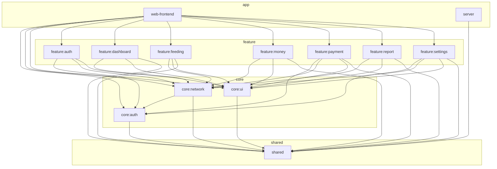

# CrabShell

Kotlin Multiplatform のダッシュボードアプリケーション。Ktor サーバー + Compose for Web (WASM) フロントエンド。

## 技術スタック

| カテゴリ | 技術 | バージョン |
|---|---|---|
| 言語 | Kotlin | 2.3.0 |
| UI | Compose Multiplatform | 1.10.0 |
| サーバー | Ktor (Netty) | 3.4.0 |
| DI | Koin | 4.2.0-RC1 |
| 認証 | Firebase Admin / Firebase JS SDK + WebAuthn (Passkey) | 9.4.3 |
| WebAuthn | webauthn4j | 0.28.5 |
| DB (Passkey) | Exposed + SQLite | 0.58.0 / 3.47.1 |
| ViewModel | Lifecycle ViewModel Compose | 2.9.6 |
| シリアライゼーション | kotlinx-serialization-json | 1.8.1 |
| JDK | Eclipse Temurin | 21 |

## アーキテクチャ

MVVM パターンで関心事を分離。ViewModel がビジネスロジック・状態管理を担当し、Screen (Composable) は UI 描画のみ。

モジュールは4層に分かれる:

| 層 | モジュール | 説明 |
|---|---|---|
| **shared** | `shared` | 共有データモデル（JVM + wasmJs） |
| **core** | `core:auth`, `core:network`, `core:ui` | 認証・通信・UI 基盤 |
| **feature** | `feature:auth`, `feature:dashboard`, `feature:feeding`, `feature:money`, `feature:payment`, `feature:report`, `feature:settings` | 各画面の ViewModel + Screen |
| **app** | `web-frontend`, `server` | アプリシェル / API サーバー |

### 依存関係図



## 構成

```
shared/              → 共有データモデル（JVM + wasmJs）
server/              → Ktor サーバー（API + 静的ファイル配信）
core/auth/           → Firebase 認証・AuthState 管理・WebAuthn JS interop
core/network/        → 認証付き HTTP クライアント + Repository（Passkey 含む）
core/ui/             → テーマ・共通 UI コンポーネント
feature/auth/        → ログイン画面（パスキー / メール・パスワード）+ パスキー登録
feature/dashboard/   → ダッシュボード画面
feature/feeding/     → ごはん記録画面
feature/money/       → 支出管理画面（管理者向け）
feature/payment/     → 支払い画面（ユーザー向け）
feature/report/      → 家計レポート画面（月別支出グラフ・内訳）
feature/settings/    → 設定画面
web-frontend/        → アプリシェル（ルーティング・レイアウト）
```

## セットアップ

### 開発

フロントエンドとサーバーを分離起動し、UI 変更の反映を高速化する。フルビルド（約5分）→ インクリメンタルビルド（数十秒）。

```bash
# Terminal 1: API サーバー（fat JAR をビルドして直接起動）
./gradlew :server:buildFatJar -PskipFrontend && \
  WEBAUTHN_RP_ID=localhost WEBAUTHN_ORIGIN=http://localhost:8080,http://localhost:3000 \
  java -jar server/build/libs/server-all.jar

# Terminal 2: webpack dev server（フロントエンド開発用）
./gradlew :web-frontend:wasmJsBrowserDevelopmentRun

# ブラウザ: http://localhost:3000
```

- webpack dev server (port 3000) が `/api/*` を Ktor サーバー (port 8080) にプロキシ
- `-PskipFrontend` でサーバービルド時に WASM フロントエンドのビルドをスキップ

| 変更箇所 | 操作 |
|----------|------|
| feature/ や core/ の Kotlin (UI) | Terminal 2 を **Ctrl+D → 再実行** |
| server/ の Kotlin (API) | Terminal 1 を再ビルド＆再起動 |
| shared/ のモデル変更 | 両方再起動 |

### 本番（GHCR デプロイ）

Dockerfile はマルチステージビルド（Gradle でビルド → JRE Alpine で実行）。ビルド済みイメージを GHCR から pull して実行する。リバースプロキシ（Traefik 等）が外部ネットワーク上で TLS 終端・ポート公開を担当する前提。HEALTHCHECK 付き。

#### イメージの push（開発マシン）

```bash
# GHCR にログイン（Personal Access Token に write:packages 権限が必要）
echo $GITHUB_TOKEN | docker login ghcr.io -u <GitHubユーザー名> --password-stdin

# ビルド & push（COMMIT_HASH を渡すとサイドバーにコミットハッシュが表示される）
docker build --build-arg COMMIT_HASH=$(git rev-parse --short HEAD) \
  -t ghcr.io/ptknktq/crabshell:latest .
docker push ghcr.io/ptknktq/crabshell:latest
```

#### 本番サーバーでの起動

以下のファイルを同じディレクトリに配置する。

`.env`:

```
WEBAUTHN_RP_ID=example.com
WEBAUTHN_ORIGIN=https://example.com
```

サブドメインの場合、`WEBAUTHN_RP_ID` には親ドメインを指定する:

```
WEBAUTHN_RP_ID=example.com
WEBAUTHN_ORIGIN=https://app.example.com
```

`docker-compose.yml`:

```yaml
services:
  crabshell:
    image: ghcr.io/ptknktq/crabshell:latest
    container_name: crabshell
    environment:
      - FIREBASE_SERVICE_ACCOUNT_PATH=/app/firebase-service-account.json
      - WEBAUTHN_RP_ID=${WEBAUTHN_RP_ID}
      - WEBAUTHN_ORIGIN=${WEBAUTHN_ORIGIN}
    volumes:
      - ./firebase-service-account.json:/app/firebase-service-account.json:ro
      - app-data:/app/data
    restart: unless-stopped
    networks:
      - web

volumes:
  app-data:

networks:
  web:
    external: true
```

リバースプロキシと共有する外部ネットワークを事前に作成しておく:

```bash
docker network create web
```

```bash
# GHCR にログイン
echo $GITHUB_TOKEN | docker login ghcr.io -u <GitHubユーザー名> --password-stdin

# 起動
docker compose up -d

# 更新
docker compose pull && docker compose up -d
```

## 認証

Firebase Auth + Passkey (WebAuthn) のハイブリッド認証。

### フロー

1. **初回**: 管理者が Firebase コンソールでユーザー作成 → メール/パスワードでログイン → パスキー登録を案内
2. **以降**: メールアドレス入力 → パスキーでログイン（パスワード不要）

### 環境変数

| 変数 | 必須 | 説明 |
|-----|------|------|
| `FIREBASE_SERVICE_ACCOUNT_PATH` | | Firebase サービスアカウントキー（デフォルト: `firebase-service-account.json`） |
| `WEBAUTHN_RP_ID` | **必須** | Relying Party ID（例: `localhost`, `example.com`） |
| `WEBAUTHN_ORIGIN` | **必須** | 許可するオリジン（カンマ区切り。例: `https://example.com`） |
| `PASSKEY_DB_PATH` | | SQLite ファイルパス（デフォルト: `data/passkey.db`） |

> `WEBAUTHN_RP_ID` / `WEBAUTHN_ORIGIN` が未設定の場合、パスキー機能は無効化されます（メール/パスワード認証のみ動作）。

## テスト

```bash
# shared モデルテスト（JVM）
./gradlew :shared:jvmTest

# server ユニットテスト
./gradlew :server:test -PskipFrontend
```

- テスト対象は純粋ロジックに絞る（Firebase/Firestore 依存のコードは対象外）
- shared: `@Serializable` モデルのシリアライズ往復テスト
- server: `ChallengeStore`、money パース関数等のユニットテスト

## Lint

ktlint を全サブプロジェクトに適用済み。

```bash
# 自動フォーマット
./gradlew ktlintFormat

# チェックのみ
./gradlew ktlintCheck
```

## 依存管理

- **Renovate Bot** がライブラリの更新を自動監視し、PR を作成する（設定: `renovate.json`）
- patch 更新は自動マージ、メジャー/マイナー更新は PR レビュー後にマージ
- 依存バージョンは `gradle/libs.versions.toml` で一元管理。関連ライブラリは `[bundles]` でグループ化

## ブランチ戦略（GitHub Flow）

`main` ブランチを常にデプロイ可能な状態に保つシンプルなフローを採用。

1. `main` から機能ブランチを作成
2. ブランチ上でコミットを重ねる
3. Pull Request を作成してレビューを依頼
4. レビュー承認後、`main` にマージ
5. マージ後にブランチを削除

### ブランチ命名規則

`feat/`, `fix/`, `chore/`, `refactor/` + 簡潔な説明（例: `feat/websocket-realtime`）

### ルール

- `main` に直接 push しない — 常に PR 経由
- PR はマージ前にレビューを受ける
- マージ後にブランチを削除して整理する
