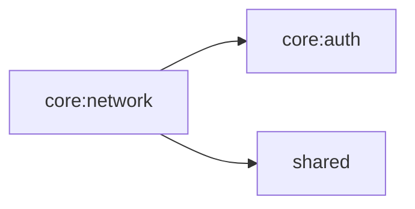

# core:network

認証トークン付き HTTP クライアントと、各ドメインの Repository を提供する。

## 依存関係

## 主要ファイル

| ファイル | 説明 |
|---|---|
| `core/network/AuthHttpClient.kt` | 認証トークン自動付与の HTTP クライアント |
| `core/network/FeedingRepository.kt` | ごはん記録リポジトリ |
| `core/network/GarbageScheduleRepository.kt` | ゴミ出しスケジュールリポジトリ |
| `core/network/MoneyRepository.kt` | 支出管理リポジトリ |
| `core/network/PetRepository.kt` | ペット情報リポジトリ |
| `core/network/UserRepository.kt` | ユーザー情報リポジトリ |
| `core/network/di/NetworkModule.kt` | Koin DI モジュール |
