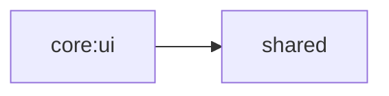

# core:ui

アプリ全体のテーマ定義（カラー・タイポグラフィ）と共通 UI コンポーネントを提供する。

## 依存関係

## 主要ファイル

| ファイル | 説明 |
|---|---|
| `core/ui/theme/Theme.kt` | テーマ構成・適用 |
| `core/ui/theme/Color.kt` | カラースキーム定義 |
| `core/ui/theme/Typography.kt` | タイポグラフィ定義 |
| `core/ui/theme/GarbageTypeUi.kt` | ゴミ種別の UI 表現 |
| `core/ui/theme/MealTimeUi.kt` | 食事時間帯の UI 表現 |
| `core/ui/WindowSizeClass.kt` | ウィンドウサイズ分類ユーティリティ |
| `core/ui/components/CalendarView.kt` | カレンダー UI コンポーネント |
| `core/ui/util/DateUtils.kt` | 日付ユーティリティ |
