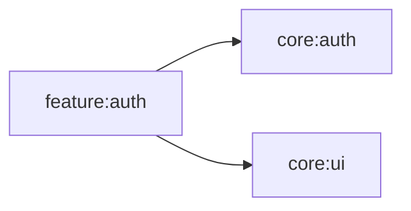

# feature:auth

ログイン画面と認証済みアプリシェルを提供する。LoginViewModel が認証フローを管理し、LoginScreen が UI を描画する。

## 依存関係

## 主要ファイル

| ファイル | 説明 |
|---|---|
| `feature/auth/LoginViewModel.kt` | ログイン ViewModel |
| `feature/auth/LoginScreen.kt` | ログイン画面 |
| `feature/auth/AuthenticatedApp.kt` | 認証済みアプリシェル |
| `feature/auth/di/FeatureAuthModule.kt` | Koin DI モジュール |
