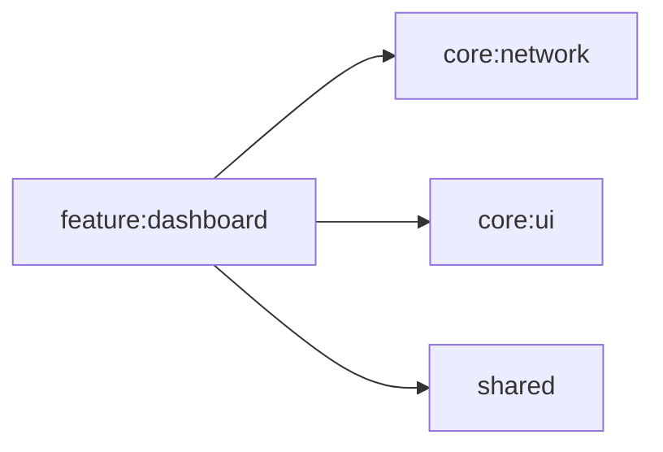

# feature:dashboard

ダッシュボード画面。ホーム画面としてアプリの概要情報を表示する。

## 依存関係

## 主要ファイル

| ファイル | 説明 |
|---|---|
| `feature/dashboard/DashboardViewModel.kt` | ダッシュボード ViewModel |
| `feature/dashboard/DashboardScreen.kt` | ダッシュボード画面 |
| `feature/dashboard/di/DashboardModule.kt` | Koin DI モジュール |
