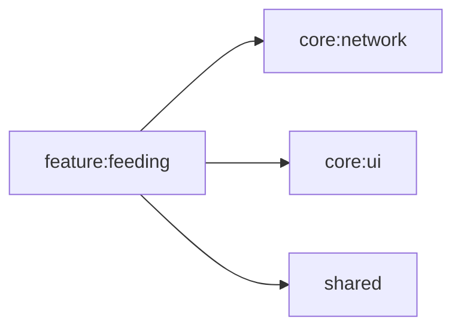

# feature:feeding

ごはん記録画面。ペットの食事記録の表示・登録を行う。

## 依存関係

## 主要ファイル

| ファイル | 説明 |
|---|---|
| `feature/feeding/FeedingViewModel.kt` | ごはん記録 ViewModel |
| `feature/feeding/FeedingScreen.kt` | ごはん記録画面 |
| `feature/feeding/di/FeedingModule.kt` | Koin DI モジュール |
