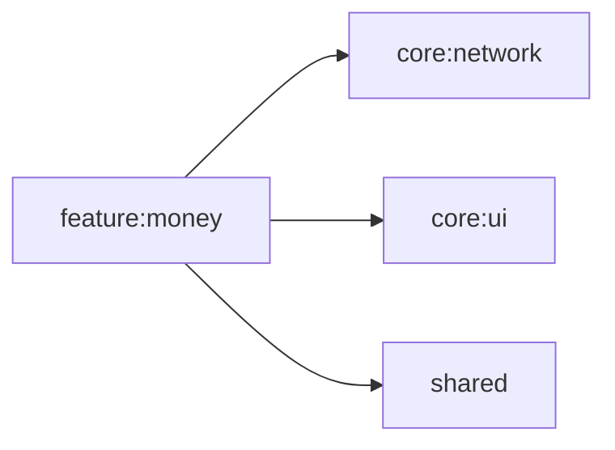

# feature:money

支出管理画面（管理者向け）。支出の一覧表示・登録・集計を行う。

## 依存関係

## 主要ファイル

| ファイル | 説明 |
|---|---|
| `feature/money/MoneyViewModel.kt` | 支出管理 ViewModel |
| `feature/money/MoneyScreen.kt` | 支出管理画面 |
| `feature/money/di/MoneyModule.kt` | Koin DI モジュール |
