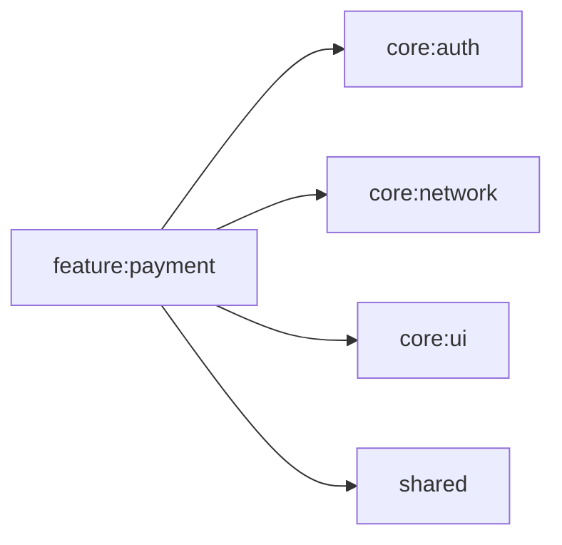

# feature:payment

支払い画面（ユーザー向け）。認証情報を利用して支払い状況の表示・操作を行う。

## 依存関係

## 主要ファイル

| ファイル | 説明 |
|---|---|
| `feature/payment/PaymentViewModel.kt` | 支払い ViewModel |
| `feature/payment/PaymentScreen.kt` | 支払い画面 |
| `feature/payment/di/PaymentModule.kt` | Koin DI モジュール |
