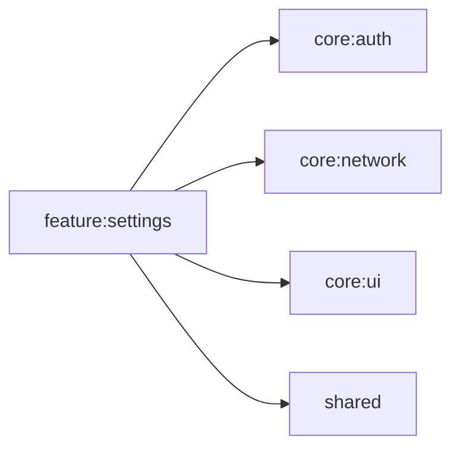

# feature:settings

設定画面。ユーザー名変更、パスワード変更、ゴミ出しスケジュール設定を提供する。

## 依存関係

## 主要ファイル

| ファイル | 説明 |
|---|---|
| `feature/settings/SettingsScreen.kt` | 設定画面 |
| `feature/settings/UserNameViewModel.kt` | ユーザー名設定 ViewModel |
| `feature/settings/PasswordChangeViewModel.kt` | パスワード変更 ViewModel |
| `feature/settings/GarbageScheduleViewModel.kt` | ゴミ出しスケジュール設定 ViewModel |
| `feature/settings/di/SettingsModule.kt` | Koin DI モジュール |
