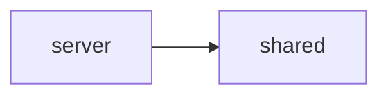

# server

Ktor (Netty) ベースの API サーバー。Firebase Admin SDK による認証検証、REST API の提供、およびビルド済み WASM フロントエンドの静的配信を行う。

## 依存関係

## 主要ファイル

| ファイル | 説明 |
|---|---|
| `server/Application.kt` | サーバーエントリーポイント・ルーティング設定 |
| `server/auth/AuthPlugin.kt` | Ktor 認証プラグイン |
| `server/auth/FirebaseAdmin.kt` | Firebase Admin SDK 初期化 |
| `server/feeding/FeedingRoutes.kt` | ごはん記録 API ルート |
| `server/garbage/GarbageRoutes.kt` | ゴミ出しスケジュール API ルート |
| `server/money/MoneyRoutes.kt` | 支出管理 API ルート |
| `server/pet/PetRoutes.kt` | ペット管理 API ルート |
| `server/user/UserRoutes.kt` | ユーザー管理 API ルート |
