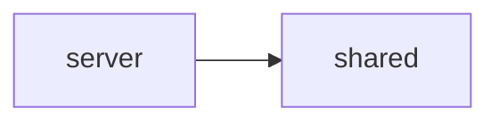

# server

Ktor (Netty) ベースの API サーバー。Firebase Admin SDK による認証検証、REST API の提供、およびビルド済み WASM フロントエンドの静的配信を行う。

## 依存関係

```mermaid
graph LR
  server --> shared
```

## 主要ファイル

| ファイル | 説明 |
|---|---|
| `server/Application.kt` | サーバーエントリーポイント・ルーティング設定 |
| `server/auth/AuthPlugin.kt` | Ktor 認証プラグイン |
| `server/auth/FirebaseAdminApp.kt` | Firebase Admin SDK（FirebaseApp）の初期化と停止時の削除 |
| `server/auth/FirebaseAdminAuthRepository.kt` | Firebase Auth 操作（ID トークン検証・ユーザー照会/更新・カスタムトークン発行） |
| `server/di/ServerModule.kt` | Koin の DI 定義 |
| `server/di/CloseOnStop.kt` | 停止時に AutoCloseable なリソースを閉じる DI 定義用のヘルパー |
| `server/feeding/FeedingRoutes.kt` | ごはん記録 API ルート |
| `server/garbage/GarbageRoutes.kt` | ゴミ出しスケジュール API ルート |
| `server/money/MoneyRoutes.kt` | 支出管理 API ルート |
| `server/passkey/PasskeyRoutes.kt` | パスキー（WebAuthn）登録・認証 API ルート |
| `server/passkey/WebAuthnVerifier.kt` | WebAuthn 登録・認証レスポンスの検証 |
| `server/passkey/ExposedPasskeyCredentialRepository.kt` | パスキーの保存先（SQLite） |
| `server/pet/PetRoutes.kt` | ペット管理 API ルート |
| `server/user/UserRoutes.kt` | ユーザー管理 API ルート |
