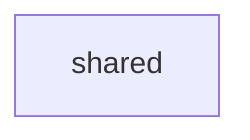

# shared

Kotlin Multiplatform の共有データモデルライブラリ。サーバー・フロントエンド全モジュールから参照される。

## 依存関係

他モジュールへの依存なし（リーフモジュール）。

## 主要ファイル

| ファイル | 説明 |
|---|---|
| `model/DashboardItem.kt` | ダッシュボードアイテムモデル |
| `model/FeedingLog.kt` | ごはん記録モデル |
| `model/GarbageSchedule.kt` | ゴミ出しスケジュールモデル |
| `model/MoneyModels.kt` | 支出関連モデル |
| `model/Pet.kt` | ペット情報モデル |
| `model/User.kt` | ユーザーアカウントモデル |
