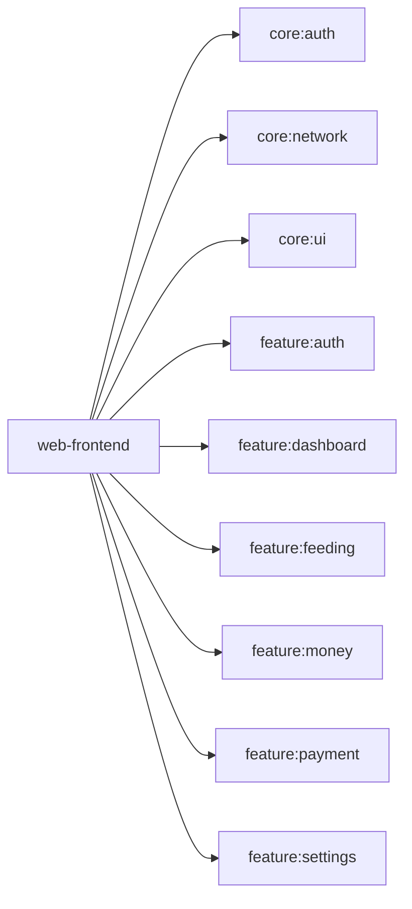

# web-frontend

Compose for Web (WASM) のアプリシェル。ルーティング、サイドバーナビゲーション、ドロワーレイアウトを構成し、全 feature モジュールを統合する。

## 依存関係

## 主要ファイル

| ファイル | 説明 |
|---|---|
| `app/Main.kt` | アプリケーションエントリーポイント |
| `app/App.kt` | メイン Composable（ルーティング・レイアウト） |
| `app/components/Sidebar.kt` | サイドバーナビゲーション |
| `app/components/DrawerContent.kt` | ドロワーコンテンツ |
| `app/components/NavigationItems.kt` | ナビゲーション項目定義 |
| `app/di/AppModule.kt` | Koin DI モジュール |
